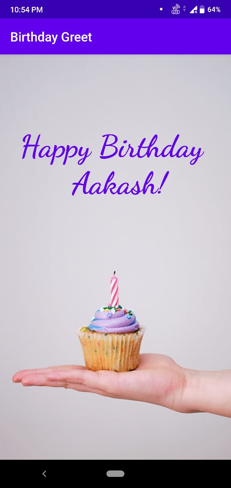

# BirthdayGreet

This is my first app. The app takes name as input from the user and then greets happy birthday with name. Made two pages using intent.

---

App link - https://drive.google.com/file/d/1emKxMnFMkUzZVRtNOVDQHeavDLsOOyOX/view?usp=sharing

---

## Screenshots :

